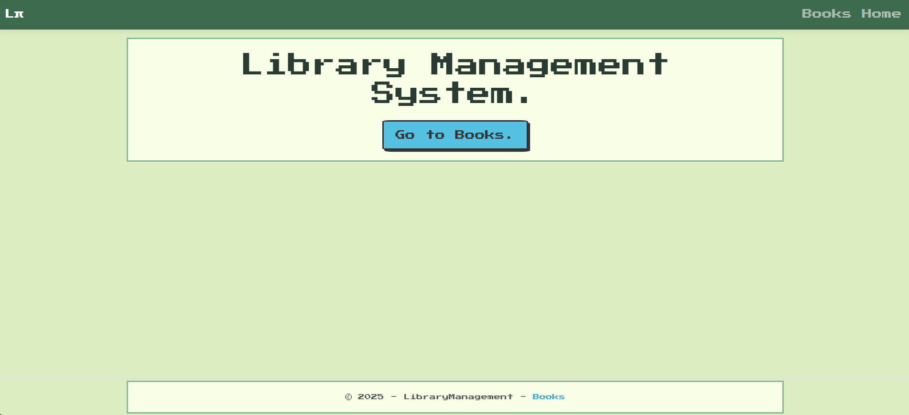
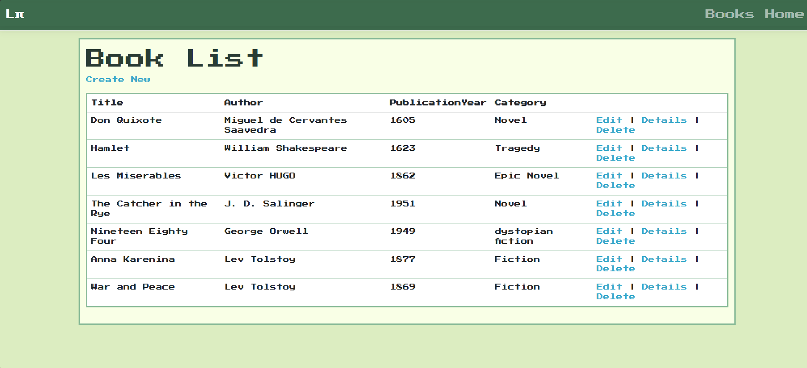
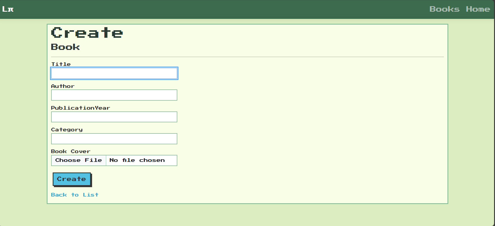
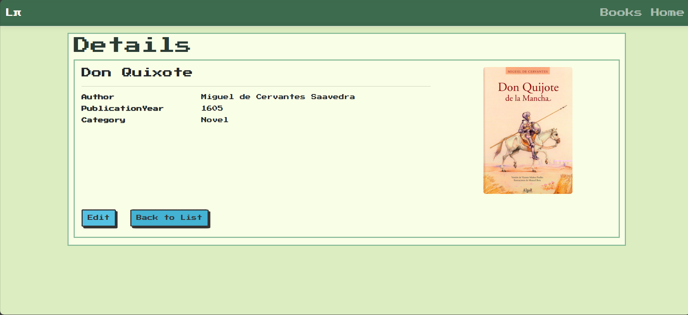
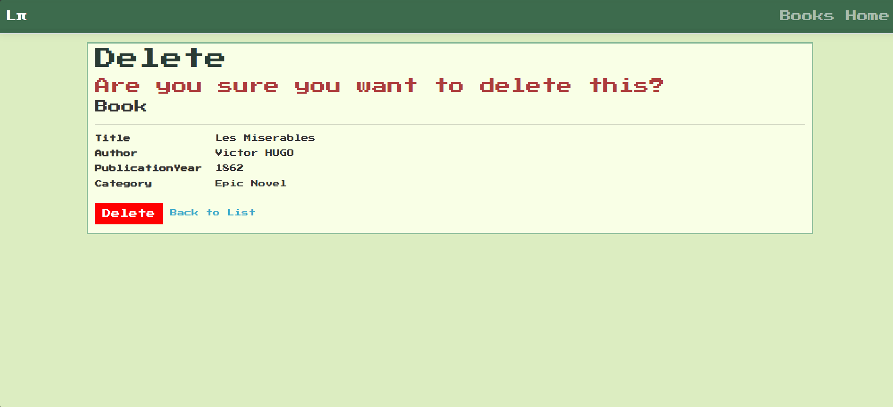

1️⃣ Project Purpose
    📌A Library Management System that allows users to add, list, update, and delete books.
   
2️⃣ Used Technologies 
🛠 Backend: ASP.NET Core (MVC) 
🛠 Database: SQLite + Entity Framework Core 
🛠 Frontend: HTML, CSS, Bootstrap

3️⃣ Code Structure Explanation 
  📌BooksController.cs → Implements CRUD operations (create, read, update, delete). 
  📌Models/Book.cs → Defines the Book model (e.g., ID, Title, Author, PublicationYear, Category, ImagePath). 
  📌Views/Books/ → Contains Razor Views for listing, creating, and editing books.
  
4️⃣ Sample Screenshots 
### Main Page (Home)

### List of Books

### Create Book Page

### Details of Book

### Delete a Book

